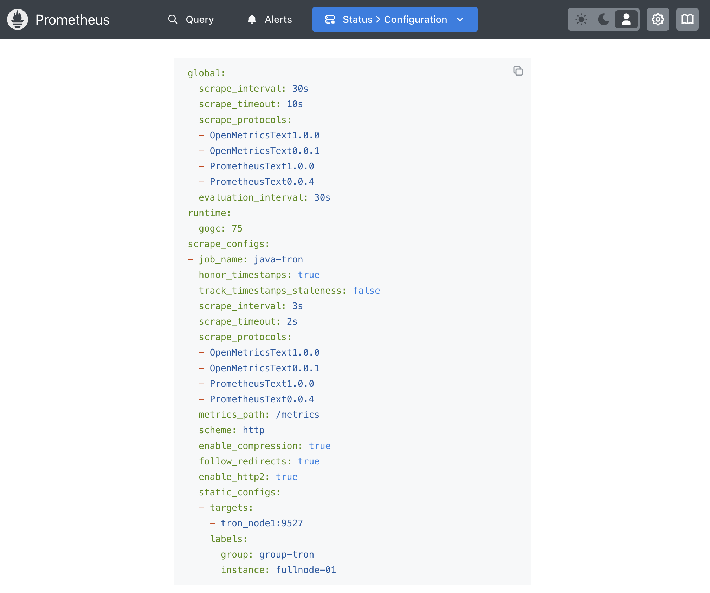
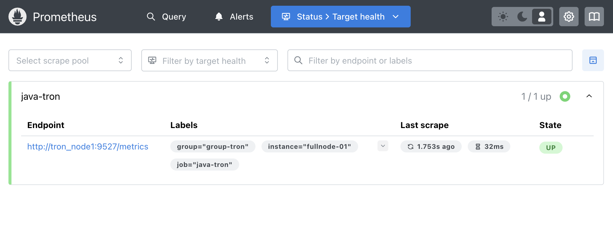
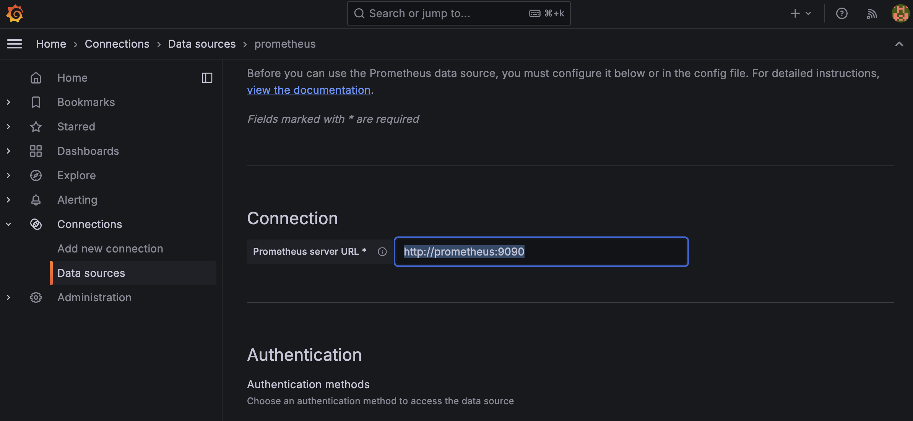
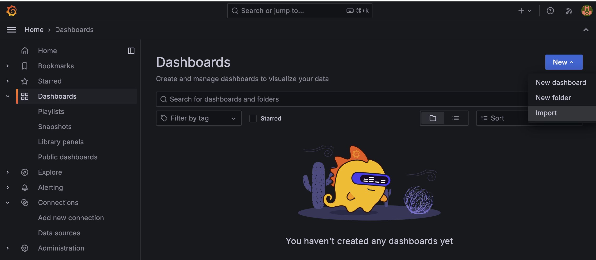
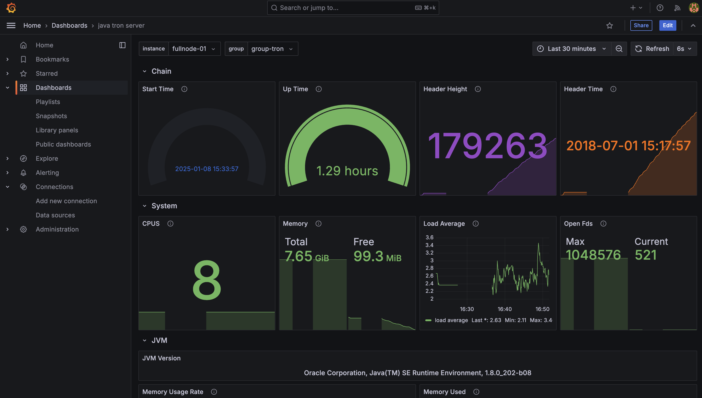

# Tron Node Metrics Monitoring
Starting from the GreatVoyage-4.5.1 (Tertullian) version, the node provides a series of interfaces compatible with the Prometheus protocol, allowing the node deployer to monitor the health status of the node more conveniently.

Below, we provide a guide on using metrics to monitor the Tron node status. Then, we list all available metrics.

## Quick Start
Download the `tron-docker` repository, enter the `metric` directory, and start the services defined in [docker-compose.yml](./docker-compose.yml) using the following command:

```sh
docker-compose up -d
```

It will start a Tron FullNode that connects to the Mainnet, along with Prometheus and Grafana services. Note that in [main_net_config.conf](../conf/main_net_config.conf), it contains the configuration below to enable metrics.
```
metrics{
  prometheus{
    enable=true 
    port="9527"
  }
}
```

### Check Prometheus Service
The Prometheus service will use the configuration file [prometheus.yml](metric_conf/prometheus.yml).It uses the configuration below to add targets for monitoring.
```
- targets:
    - tron_node1:9527 # use container name or local IP address
  labels:
     group: group-tron
     instance: fullnode-01
```

You can view the running status of the Prometheus service at `http://localhost:9090/`. Click on "Status" -> "Configuration" to check whether the configuration file used by the container is correct.


If you want to monitor more nodes, simply add more targets following the same format. Click on "Status" -> "Targets" to view the status of each monitored java-tron node.

**Notice**: Please use `http://localhost:9527/metrics` for all metrics instead of `http://tron_node1:9527/metrics`, as the latter is used for container access inside Docker.

### Check Grafana Service
After startup, you can log in to the Grafana web UI through [http://localhost:3000/](http://localhost:3000/). The initial username and password are both `admin`. After logging in, change the password according to the prompts, and then you can enter the main interface.

Click the settings icon on the left side of the main page and select "Data Sources" to configure Grafana data sources. Enter the ip and port of the prometheus service in URL with `http://prometheus:9090`.


#### Import Dashboard
For the convenience of java-tron node deployers, the TRON community provides a comprehensive dashboard configuration file [grafana_dashboard_tron_server.json](metric_conf/grafana_dashboard_tron_server.json). 
Click the Grafana dashboards icon on the left, then select "New" and "Import", then click "Upload JSON file" to import the downloaded dashboard configuration file:


Then you can see the following monitors displaying the running status of the nodes in real time:


Below, we will introduce all supported metrics to facilitate customizing your dashboard.

## All Metrics
As you can see from above Grafana dashboard or http://localhost:9527/metrics, the available metrics are categorized into the following:

- Blockchain status
- Node system status
- JVM status
- Block and transaction status
- Network peer status
- API information
- Database information

### Blockchain Status

### Node System Status

- process_cpu_load: Process cpu load
- process_cpu_seconds_total
- process_max_fds: Maximum number of open file descriptors.
- process_open_fds: Number of open file descriptors.
- process_resident_memory_bytes: Resident memory size in bytes.
- process_start_time_seconds: Start time of the process since unix epoch in seconds.
- process_virtual_memory_bytes

- system_available_cpus: System available cpus
- system_cpu_load: System cpu load
- system_free_physical_memory_bytes: System free physical memory bytes
- system_free_swap_spaces_bytes: System free swap spaces
- system_load_average: System cpu load average
- system_total_physical_memory_bytes: System total physical memory bytes
- system_total_swap_spaces_bytes: System free swap spaces bytes

### JVM Status

**JVM Basic Info**

- jvm_info: Basic JVM info with version.
- jvm_classes_currently_loaded: The number of classes that are currently loaded in the JVM.
- jvm_classes_loaded_total
- jvm_classes_unloaded_total

**JVM Thread Related**

* jvm_threads_current  
* jvm_threads_daemon 
* jvm_threads_peak 
* jvm_threads_started_total 
* jvm_threads_deadlocked 
* jvm_threads_deadlocked_monitor 
* jvm_threads_state{state="RUNNABLE"} 
* jvm_threads_state{state="TERMINATED"} 
* jvm_threads_state{state="TIMED_WAITING"}  
* jvm_threads_state{state="NEW"} 
* jvm_threads_state{state="WAITING"}  
* jvm_threads_state{state="BLOCKED"}  

**JVM Garbage Collection**

* jvm_gc_collection_seconds_count: Count of JVM garbage collector event.
* jvm_gc_collection_seconds_sum:	Total sum of (Time spent in a given JVM garbage collector in seconds.)

**JVM Memory Related**

* jvm_buffer_pool_capacity_bytes: Bytes capacity of a given JVM buffer pool.
* jvm_buffer_pool_used_buffers: Used buffers of a given JVM buffer pool.
* jvm_buffer_pool_used_bytes:Used bytes of a given JVM buffer pool.
* jvm_memory_bytes_committed: Committed (bytes) of a given JVM memory area.
* jvm_memory_bytes_init: Initial bytes of a given JVM memory area.
* jvm_memory_bytes_max: Max (bytes) of a given JVM memory area.
* jvm_memory_bytes_used: Used bytes of a given JVM memory area.
* jvm_memory_objects_pending_finalization: The number of objects waiting in the finalizer queue.
* jvm_memory_pool_allocated_bytes_created			
* jvm_memory_pool_allocated_bytes_total			
* jvm_memory_pool_bytes_committed: Committed bytes of a given JVM memory pool.
* jvm_memory_pool_bytes_init: Initial bytes of a given JVM memory pool.
* jvm_memory_pool_bytes_max: Max bytes of a given JVM memory pool.
* jvm_memory_pool_bytes_used: Used bytes of a given JVM memory pool.
* jvm_memory_pool_collection_committed_bytes: Committed after last collection bytes of a given JVM memory pool.
* jvm_memory_pool_collection_init_bytes: Initial after last collection bytes of a given JVM memory pool.
* jvm_memory_pool_collection_max_bytes: Max bytes after last collection of a given JVM memory pool.
* jvm_memory_pool_collection_used_bytes: Used bytes after last collection of a given JVM memory pool.


### Block and Transaction Status

### Network peer status

### API Information

### Database Information


